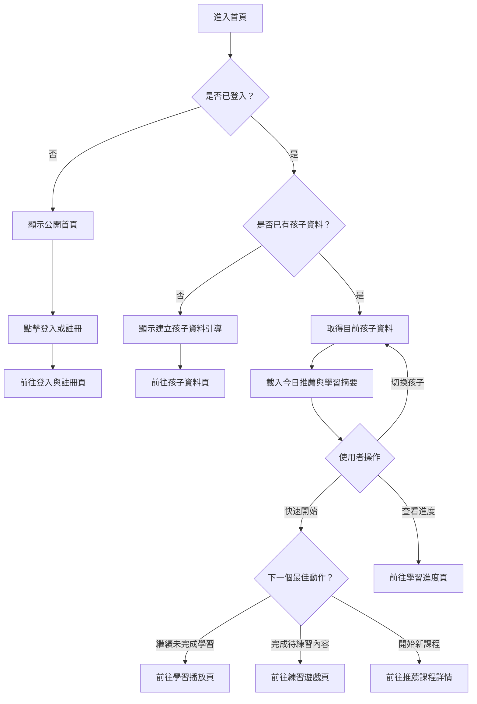

# 首頁操作流程圖

## 頁面虛線圖

```text
+------------------------------------------------------------+
| Logo 小孩語言學習                         [家長中心] [登入] |
+------------------------------------------------------------+
| 目前孩子：小安                         [切換孩子 v]        |
|                                                            |
| 今日學習                                                   |
| +--------------------------------------------------------+ |
| | 推薦：動物英文單字                                     | |
| | 進度：第 2 / 5 單元                                    | |
| | [快速開始] [查看課程]                                  | |
| +--------------------------------------------------------+ |
|                                                            |
| 學習摘要                                                   |
| +-------------+ +-------------+ +-------------+             |
| | 連續 3 天   | | 完成 8 單元 | | 星星 120    |             |
| +-------------+ +-------------+ +-------------+             |
|                                                            |
| 快速入口                                                   |
| [課程探索] [練習遊戲] [學習進度] [獎勵成就]                |
+------------------------------------------------------------+
```

## 按鈕與操作

| 按鈕 | 出現條件 | 點擊後動作 |
| --- | --- | --- |
| 登入 | 未登入 | 前往登入與註冊頁 |
| 註冊 | 未登入 | 前往登入與註冊頁的註冊模式 |
| 建立孩子資料 | 已登入但沒有孩子 | 前往孩子資料頁 |
| 切換孩子 | 已登入且有多位孩子 | 更新目前孩子並重新載入首頁 |
| 快速開始 | 已登入且有目前孩子 | 依下一個最佳動作導向學習播放、練習遊戲或課程詳情 |
| 查看課程 | 有推薦課程 | 前往課程詳情頁 |
| 課程探索 | 永遠顯示 | 前往課程探索頁 |
| 練習遊戲 | 已登入且有孩子 | 前往可練習內容，沒有內容時顯示提示 |
| 學習進度 | 已登入且有孩子 | 前往學習進度頁 |
| 獎勵成就 | 已登入且有孩子 | 前往獎勵成就頁 |

## 音效規劃

| 觸發 | 音效 | 規則 |
| --- | --- | --- |
| 點擊主要入口按鈕 | `ui_click` | 音效開啟時播放 |
| 切換孩子 | `ui_toggle` | 切換成功後播放 |
| 快速開始成功導向 | `ui_click` | 不蓋過下一頁教學語音 |
| 首頁資料載入失敗 | `ui_error_soft` | 同時顯示錯誤文字 |

## 使用者流程



## 正確性檢查

- 未登入流程不可讀取孩子資料。
- 沒有孩子資料時，主要出口必須是孩子資料頁。
- 快速開始出口需與 `features.md` 的導向規則一致。
- 切換孩子後必須重新載入推薦與摘要。
