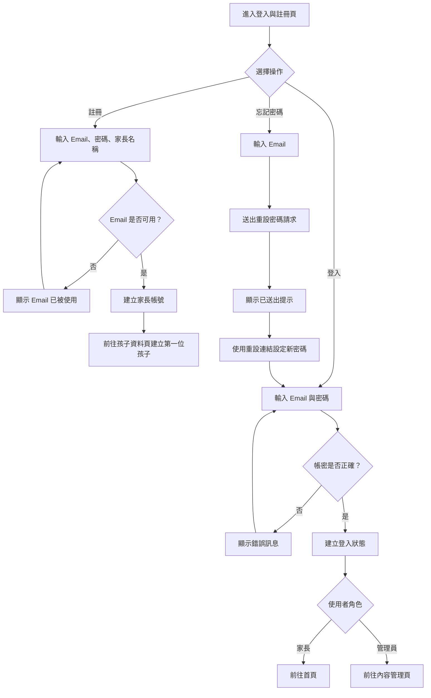

# 登入與註冊操作流程圖

## 頁面虛線圖

```text
+------------------------------------------------------------+
| Logo 小孩語言學習                              [回首頁]     |
+------------------------------------------------------------+
|                    [登入] [註冊]                           |
|                                                            |
| Email                                                      |
| +--------------------------------------------------------+ |
| | user@example.com                                      | |
| +--------------------------------------------------------+ |
| 密碼                                                       |
| +--------------------------------------------------------+ |
| | ********                                              | |
| +--------------------------------------------------------+ |
|                                                            |
| [登入]                                                     |
| [忘記密碼]                                                 |
|                                                            |
| 錯誤訊息區：帳號或密碼錯誤                                 |
+------------------------------------------------------------+
```

## 按鈕與操作

| 按鈕 | 出現條件 | 點擊後動作 |
| --- | --- | --- |
| 回首頁 | 永遠顯示 | 返回首頁 |
| 登入 Tab | 永遠顯示 | 顯示登入表單 |
| 註冊 Tab | 永遠顯示 | 顯示註冊表單 |
| 登入 | 登入模式 | 送出登入 API，成功後依角色導向 |
| 建立帳號 | 註冊模式 | 送出註冊 API，成功後前往孩子資料頁 |
| 忘記密碼 | 登入模式 | 顯示忘記密碼表單 |
| 送出重設信 | 忘記密碼模式 | 呼叫密碼重設 API 並顯示提示 |

## 音效規劃

| 觸發 | 音效 | 規則 |
| --- | --- | --- |
| 切換登入或註冊 Tab | `ui_toggle` | 音效開啟時播放 |
| 登入成功 | `page_success` | 播放後導向下一頁 |
| 註冊成功 | `page_success` | 播放後前往孩子資料頁 |
| 表單錯誤 | `ui_error_soft` | 不可刺耳，需搭配欄位錯誤文字 |
| 密碼重設信送出 | `page_success` | 不透露 Email 是否存在 |

## 使用者流程



## 正確性檢查

- 登入成功後需依角色導向。
- 註冊成功後不可直接進入完整學習流程，需先建立孩子資料。
- 忘記密碼不可透露 Email 是否存在。
- 登出與 session 失效規則需由 API 設計支援。
