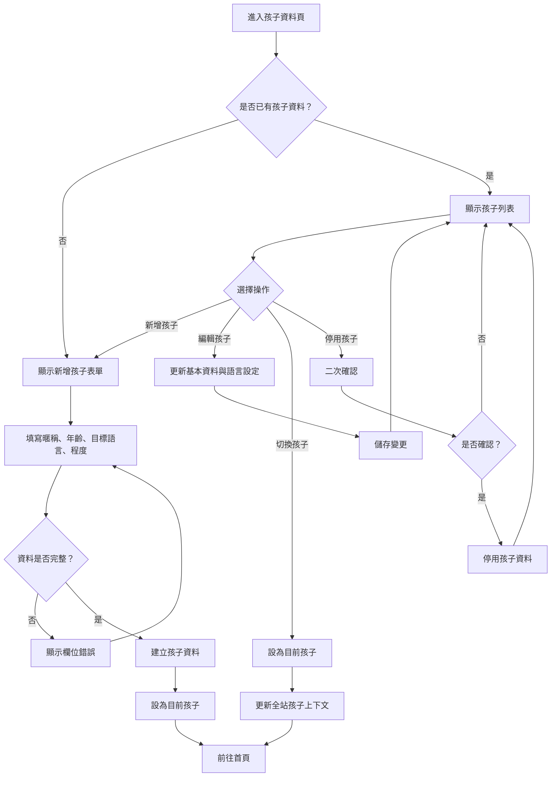

# 孩子資料操作流程圖

## 頁面虛線圖

```text
+------------------------------------------------------------+
| 孩子資料                                      [回首頁]      |
+------------------------------------------------------------+
| 孩子列表                                      [新增孩子]    |
| +--------------------------------------------------------+ |
| | 小安  6 歲  英文 初級               [設為目前] [編輯]   | |
| | 小美  8 歲  日文 入門               [設為目前] [編輯]   | |
| +--------------------------------------------------------+ |
|                                                            |
| 編輯區                                                     |
| 暱稱 [小安________________]                                |
| 年齡 [6___]                                                |
| 母語 [中文 v]  目標語言 [英文 v]  程度 [初級 v]             |
|                                                            |
| [儲存] [取消] [停用孩子]                                   |
+------------------------------------------------------------+
```

## 按鈕與操作

| 按鈕 | 出現條件 | 點擊後動作 |
| --- | --- | --- |
| 回首頁 | 已有目前孩子 | 返回首頁 |
| 新增孩子 | 永遠顯示 | 開啟新增孩子表單 |
| 設為目前 | 有多位孩子 | 更新目前孩子 |
| 編輯 | 孩子列表中 | 載入孩子資料到編輯區 |
| 儲存 | 新增或編輯中 | 驗證欄位並建立或更新孩子資料 |
| 取消 | 新增或編輯中 | 放棄變更回到列表 |
| 停用孩子 | 編輯既有孩子 | 二次確認後停用孩子資料 |

## 音效規劃

| 觸發 | 音效 | 規則 |
| --- | --- | --- |
| 新增孩子成功 | `page_success` | 第一位孩子建立後播放 |
| 儲存孩子資料成功 | `page_success` | 儲存完成才播放 |
| 切換目前孩子 | `ui_toggle` | 切換成功後播放 |
| 表單欄位錯誤 | `ui_error_soft` | 搭配欄位提示 |
| 停用孩子確認 | `ui_error_soft` | 只在確認提示出現時輕播放 |

## 使用者流程



## 正確性檢查

- 第一位孩子建立後必須設為目前孩子。
- 每位孩子的學習進度與獎勵需獨立。
- 停用孩子不可直接刪除學習紀錄。
- 切換孩子後首頁、進度、推薦都需同步更新。
