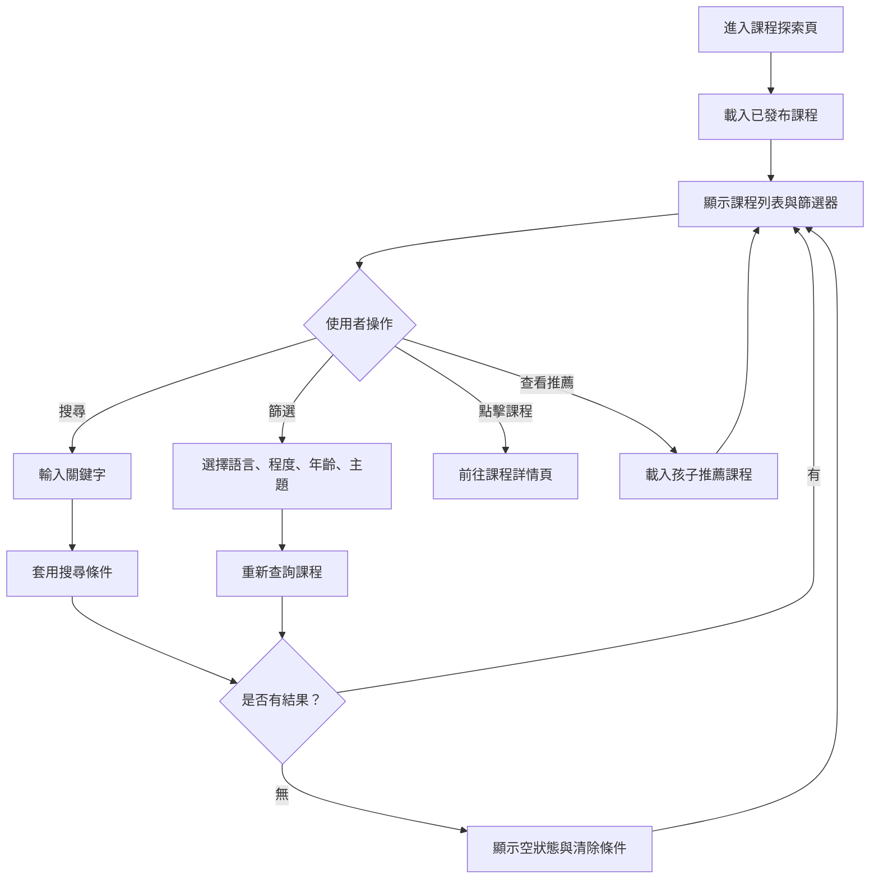

# 課程探索操作流程圖

## 頁面虛線圖

```text
+------------------------------------------------------------+
| 課程探索                                      [回首頁]      |
+------------------------------------------------------------+
| 搜尋 [動物單字____________________] [搜尋] [清除]           |
|                                                            |
| 篩選：語言 [英文 v] 程度 [初級 v] 年齡 [6-8 v] 主題 [動物 v] |
|                                                            |
| 推薦課程                                                   |
| +------------------+ +------------------+ +----------------+ |
| | 動物英文單字     | | 顏色與形狀       | | 我的家庭       | |
| | 5 單元 初級      | | 4 單元 入門      | | 6 單元 初級    | |
| | [查看詳情]       | | [查看詳情]       | | [查看詳情]     | |
| +------------------+ +------------------+ +----------------+ |
|                                                            |
| 無結果時：[清除篩選] [查看熱門課程]                         |
+------------------------------------------------------------+
```

## 按鈕與操作

| 按鈕 | 出現條件 | 點擊後動作 |
| --- | --- | --- |
| 回首頁 | 永遠顯示 | 返回首頁 |
| 搜尋 | 搜尋欄有輸入 | 套用關鍵字查詢 |
| 清除 | 有搜尋或篩選條件 | 清除條件並重新載入列表 |
| 篩選選單 | 永遠顯示 | 變更條件後重新查詢課程 |
| 查看詳情 | 每張課程卡片 | 前往課程詳情頁 |
| 查看熱門課程 | 無結果時 | 清除條件並載入熱門課程 |

## 音效規劃

| 觸發 | 音效 | 規則 |
| --- | --- | --- |
| 套用篩選器 | `ui_toggle` | 節流播放，避免連續篩選疊音 |
| 點擊課程卡片 | `ui_click` | 導向課程詳情 |
| 搜尋無結果 | `ui_error_soft` | 搭配空狀態畫面 |
| 清除篩選 | `ui_toggle` | 重新載入列表後播放 |

## 使用者流程



## 正確性檢查

- 前台只顯示已發布課程。
- 搜尋與篩選條件需可同時套用。
- 無結果時要能清除條件回到可瀏覽狀態。
- 課程卡片出口必須是課程詳情頁。
