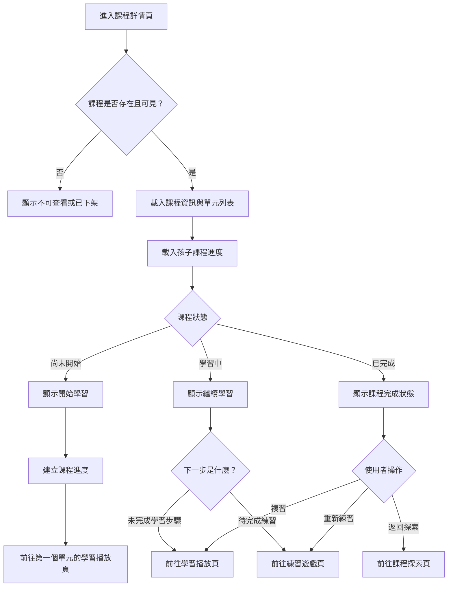

# 課程詳情操作流程圖

## 頁面虛線圖

```text
+------------------------------------------------------------+
| 課程詳情                                      [返回探索]    |
+------------------------------------------------------------+
| 動物英文單字                                               |
| 封面圖                                                     |
| 適合：6-8 歲 / 英文初級 / 5 單元                            |
|                                                            |
| 學習目標                                                   |
| - 認識 20 個動物單字                                       |
| - 能聽懂簡短句子                                           |
|                                                            |
| [開始學習] 或 [繼續學習] 或 [重新練習]                      |
|                                                            |
| 單元列表                                                   |
| 1. Farm Animals      已完成        [複習] [練習]            |
| 2. Zoo Animals       學習中        [繼續]                   |
| 3. Ocean Animals     尚未開始      [開始]                   |
+------------------------------------------------------------+
```

## 按鈕與操作

| 按鈕 | 出現條件 | 點擊後動作 |
| --- | --- | --- |
| 返回探索 | 永遠顯示 | 回課程探索頁 |
| 開始學習 | 課程尚未開始 | 建立進度並前往第一個單元 |
| 繼續學習 | 課程學習中 | 前往未完成學習步驟或待練習內容 |
| 複習 | 單元已完成 | 前往學習播放頁 |
| 練習 | 單元有練習題 | 前往練習遊戲頁 |
| 開始 | 單元尚未開始 | 前往該單元學習播放頁 |
| 重新練習 | 課程或單元已完成 | 建立新的練習 session |

## 音效規劃

| 觸發 | 音效 | 規則 |
| --- | --- | --- |
| 開始學習 | `ui_click` | 不與學習播放頁自動語音重疊 |
| 繼續學習 | `ui_click` | 導向前播放 |
| 單元已完成狀態顯示 | 無 | 避免每次進頁重複播放完成音 |
| 點擊練習 | `ui_click` | 建立 session 前播放或導向後播放 |
| 課程不可查看 | `ui_error_soft` | 搭配不可查看訊息 |

## 使用者流程



## 正確性檢查

- 下架或草稿課程不可被一般使用者查看。
- 開始學習前需建立或確認進度紀錄。
- 繼續學習出口需依進度判斷。
- 課程完成後仍需提供複習或重新練習入口。
