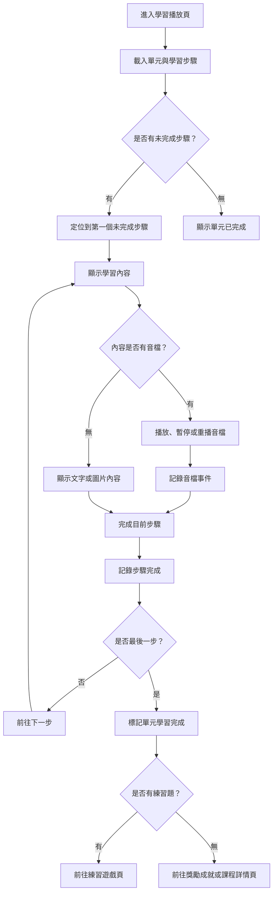

# 學習播放操作流程圖

## 頁面虛線圖

```text
+------------------------------------------------------------+
| 學習播放                         [返回課程] [離開並儲存]   |
+------------------------------------------------------------+
| 單元：Zoo Animals                         步驟 2 / 5       |
| +--------------------------------------------------------+ |
| | 圖片：Lion                                             | |
| |                                                        | |
| | 單字：lion                                             | |
| | 翻譯：獅子                                             | |
| +--------------------------------------------------------+ |
|                                                            |
| 音檔控制：[播放] [暫停] [重播]                             |
| 跟讀：[開始錄音] [停止] [完成跟讀]                          |
|                                                            |
| [上一個] [我學會了] [下一個]                                |
+------------------------------------------------------------+
```

## 按鈕與操作

| 按鈕 | 出現條件 | 點擊後動作 |
| --- | --- | --- |
| 返回課程 | 永遠顯示 | 回課程詳情頁 |
| 離開並儲存 | 永遠顯示 | 儲存目前進度後返回 |
| 播放 | 有音檔 | 播放音檔並記錄事件 |
| 暫停 | 音檔播放中 | 暫停音檔 |
| 重播 | 有音檔 | 從頭播放音檔 |
| 開始錄音 | 跟讀步驟 | 開始跟讀紀錄 |
| 完成跟讀 | 跟讀步驟 | 標記跟讀完成 |
| 上一個 | 非第一步 | 回上一學習步驟 |
| 我學會了 | 每個步驟 | 記錄步驟完成 |
| 下一個 | 當前步驟完成 | 前往下一步，最後一步導向練習或獎勵 |

## 音效規劃

| 觸發 | 音效 | 規則 |
| --- | --- | --- |
| 播放教學語音 | 教學語音音檔 | 優先權最高，同時間只播放一個 |
| 暫停教學語音 | 無 | 不需要額外 UI 音效 |
| 重播教學語音 | 教學語音音檔 | 從頭播放並記錄音檔事件 |
| 點擊我學會了 | `learning_step_complete` | 步驟完成成功後播放 |
| 完成最後一步 | `learning_unit_complete` | 單元完成後播放 |
| 音檔載入失敗 | `ui_error_soft` | 顯示重試按鈕，不自動重複播放錯誤音 |
| 跟讀完成 | `learning_step_complete` | MVP 只代表完成，不代表發音正確 |

## 使用者流程



## 正確性檢查

- 中途離開後需可從未完成步驟繼續。
- 音檔事件與步驟完成事件需分開記錄。
- 最後一步完成後才可標記單元完成。
- 有練習題時，下一個主要出口是練習遊戲頁。
