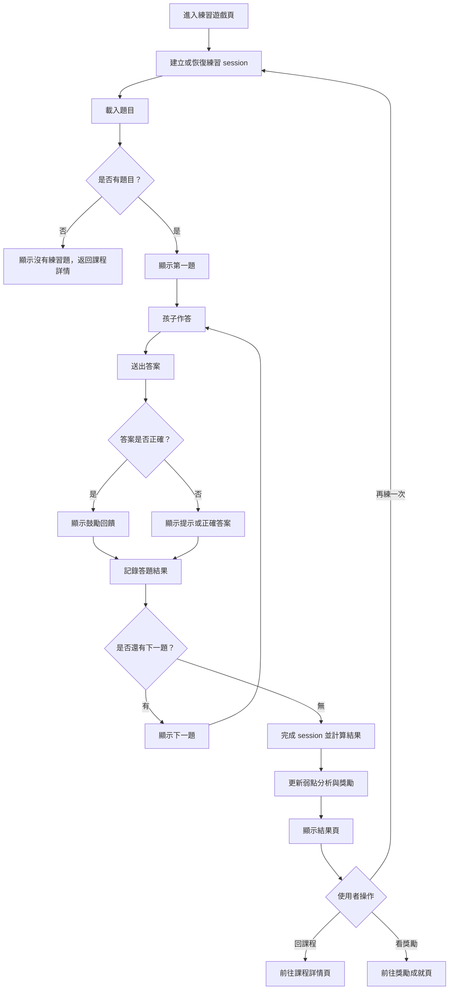

# 練習遊戲操作流程圖

## 頁面虛線圖

```text
+------------------------------------------------------------+
| 練習遊戲                         [返回課程] [離開練習]     |
+------------------------------------------------------------+
| 題目 3 / 10                                      星星：8    |
|                                                            |
| 聽一聽，選出正確圖片                                       |
| [播放音檔] [重播]                                          |
|                                                            |
| +----------------+ +----------------+ +----------------+    |
| | 圖片 A         | | 圖片 B         | | 圖片 C         |    |
| | [選擇]         | | [選擇]         | | [選擇]         |    |
| +----------------+ +----------------+ +----------------+    |
|                                                            |
| 回饋區：答對了！                                           |
| [再試一次] [下一題]                                        |
+------------------------------------------------------------+
```

## 按鈕與操作

| 按鈕 | 出現條件 | 點擊後動作 |
| --- | --- | --- |
| 返回課程 | 永遠顯示 | 回課程詳情頁 |
| 離開練習 | session 未完成 | 儲存 session 狀態後離開 |
| 播放音檔 | 聽力題 | 播放題目音檔 |
| 重播 | 聽力題 | 重新播放音檔 |
| 選擇 | 選項題 | 送出答案並顯示回饋 |
| 再試一次 | 題目允許重試且答錯 | 保留題目重新作答 |
| 下一題 | 已作答 | 顯示下一題或完成結果 |
| 再練一次 | 結果頁 | 建立新的練習 session |
| 看獎勵 | 結果頁且有獎勵 | 前往獎勵成就頁 |

## 音效規劃

| 觸發 | 音效 | 規則 |
| --- | --- | --- |
| 播放聽力題音檔 | 題目音檔 | 與教學語音同樣優先，不與 UI 音效重疊 |
| 選擇答案 | `ui_click` | 送出前輕播放 |
| 答對 | `answer_correct` | 顯示鼓勵回饋時播放 |
| 答錯 | `answer_wrong_soft` | 音色柔和，不使用失敗或刺耳聲 |
| 下一題 | `ui_click` | 答題回饋音效結束後才允許播放 |
| 練習完成且有星星 | `reward_star` | 結果頁顯示星星增加時播放 |
| 練習完成且有徽章 | `reward_badge` | 只在新徽章解鎖時播放 |

## 使用者流程



## 正確性檢查

- 每次練習需有 session 可追蹤。
- 答題結果需先記錄，再完成 session。
- 結果需回寫弱點分析與獎勵判斷。
- 沒有題目時不可卡在空白遊戲頁。
