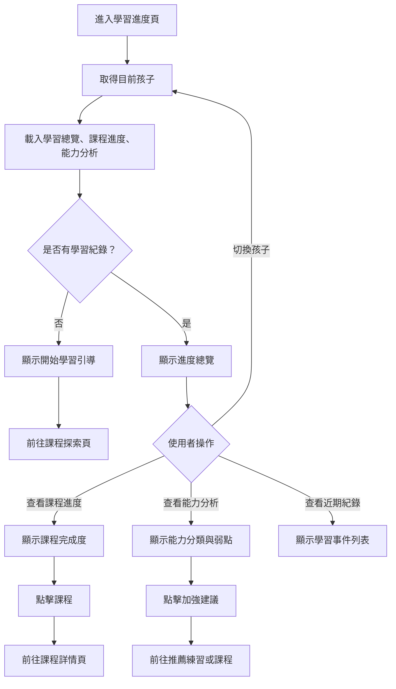

# 學習進度操作流程圖

## 頁面虛線圖

```text
+------------------------------------------------------------+
| 學習進度                                      [回首頁]      |
+------------------------------------------------------------+
| 目前孩子：小安                         [切換孩子 v]        |
|                                                            |
| 總覽                                                       |
| +------------+ +------------+ +------------+ +------------+ |
| | 完成課程 2 | | 完成單元 8 | | 連續 3 天 | | 星星 120   | |
| +------------+ +------------+ +------------+ +------------+ |
|                                                            |
| [課程進度] [能力分析] [近期紀錄]                            |
|                                                            |
| 課程進度                                                   |
| 動物英文單字  60%  [查看課程] [繼續學習]                    |
| 顏色與形狀    100% [複習] [重新練習]                        |
|                                                            |
| 需要加強：聽力、動物單字                         [開始練習] |
+------------------------------------------------------------+
```

## 按鈕與操作

| 按鈕 | 出現條件 | 點擊後動作 |
| --- | --- | --- |
| 回首頁 | 永遠顯示 | 返回首頁 |
| 切換孩子 | 有多位孩子 | 重新載入該孩子統計 |
| 課程進度 Tab | 永遠顯示 | 顯示課程完成度 |
| 能力分析 Tab | 永遠顯示 | 顯示能力分類與弱點 |
| 近期紀錄 Tab | 永遠顯示 | 顯示學習事件 |
| 查看課程 | 每個課程進度項目 | 前往課程詳情頁 |
| 繼續學習 | 課程未完成 | 前往學習播放或練習遊戲 |
| 複習 | 課程已完成 | 前往學習播放頁 |
| 重新練習 | 有練習題 | 前往練習遊戲頁 |
| 開始練習 | 有弱點建議 | 前往推薦練習 |

## 音效規劃

| 觸發 | 音效 | 規則 |
| --- | --- | --- |
| 切換 Tab | `ui_toggle` | 課程進度、能力分析、近期紀錄切換 |
| 切換孩子 | `ui_toggle` | 資料重新載入後播放 |
| 點擊繼續學習 | `ui_click` | 導向學習播放或練習遊戲 |
| 沒有學習紀錄 | 無 | 只顯示引導，不播放錯誤音 |
| 統計載入失敗 | `ui_error_soft` | 搭配重試按鈕 |

## 使用者流程



## 正確性檢查

- 沒有學習紀錄時不可顯示空白圖表。
- 課程完成度需與單元完成狀態一致。
- 弱點建議需能導向可執行的學習或練習。
- 切換孩子後所有統計資料需重新載入。
