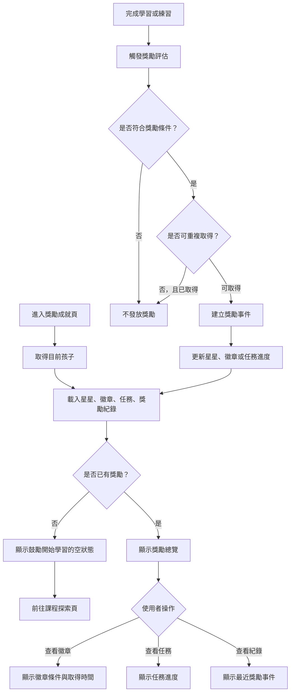

# 獎勵成就操作流程圖

## 頁面虛線圖

```text
+------------------------------------------------------------+
| 獎勵成就                                      [回首頁]      |
+------------------------------------------------------------+
| 目前孩子：小安                         [切換孩子 v]        |
|                                                            |
| 星星總數：120                              [去學習]         |
|                                                            |
| [徽章] [任務] [獎勵紀錄]                                    |
|                                                            |
| 徽章牆                                                     |
| +-------------+ +-------------+ +-------------+              |
| | 初次學習    | | 連續 3 天   | | 練習全對    |              |
| | 已取得      | | 已取得      | | 未取得      |              |
| | [查看]      | | [查看]      | | [查看條件]  |              |
| +-------------+ +-------------+ +-------------+              |
|                                                            |
| 任務：今天完成 1 個單元  0 / 1                 [開始任務]   |
+------------------------------------------------------------+
```

## 按鈕與操作

| 按鈕 | 出現條件 | 點擊後動作 |
| --- | --- | --- |
| 回首頁 | 永遠顯示 | 返回首頁 |
| 切換孩子 | 有多位孩子 | 重新載入該孩子獎勵 |
| 去學習 | 永遠顯示 | 前往課程探索或首頁快速開始 |
| 徽章 Tab | 永遠顯示 | 顯示徽章牆 |
| 任務 Tab | 永遠顯示 | 顯示任務進度 |
| 獎勵紀錄 Tab | 永遠顯示 | 顯示獎勵事件列表 |
| 查看 | 已取得徽章 | 顯示取得時間與來源 |
| 查看條件 | 未取得徽章 | 顯示取得條件 |
| 開始任務 | 任務進行中 | 前往對應課程或練習 |

## 音效規劃

| 觸發 | 音效 | 規則 |
| --- | --- | --- |
| 星星增加動畫 | `reward_star` | 只在新獎勵進帳時播放 |
| 新徽章解鎖 | `reward_badge` | 不可每次進頁重複播放 |
| 任務完成 | `mission_complete` | 任務剛達標時播放 |
| 切換徽章、任務、紀錄 Tab | `ui_toggle` | 音效開啟時播放 |
| 查看條件 | `ui_click` | 不與獎勵音效重疊 |
| 沒有獎勵 | 無 | 顯示鼓勵畫面，不播放錯誤音 |

## 使用者流程



## 正確性檢查

- 獎勵頁能讀取結果，也要支援學習完成後觸發評估。
- 不可重複徽章需防止重複發放。
- 點數型獎勵需有事件紀錄可追溯。
- 任務進度需與學習事件、練習結果一致。
