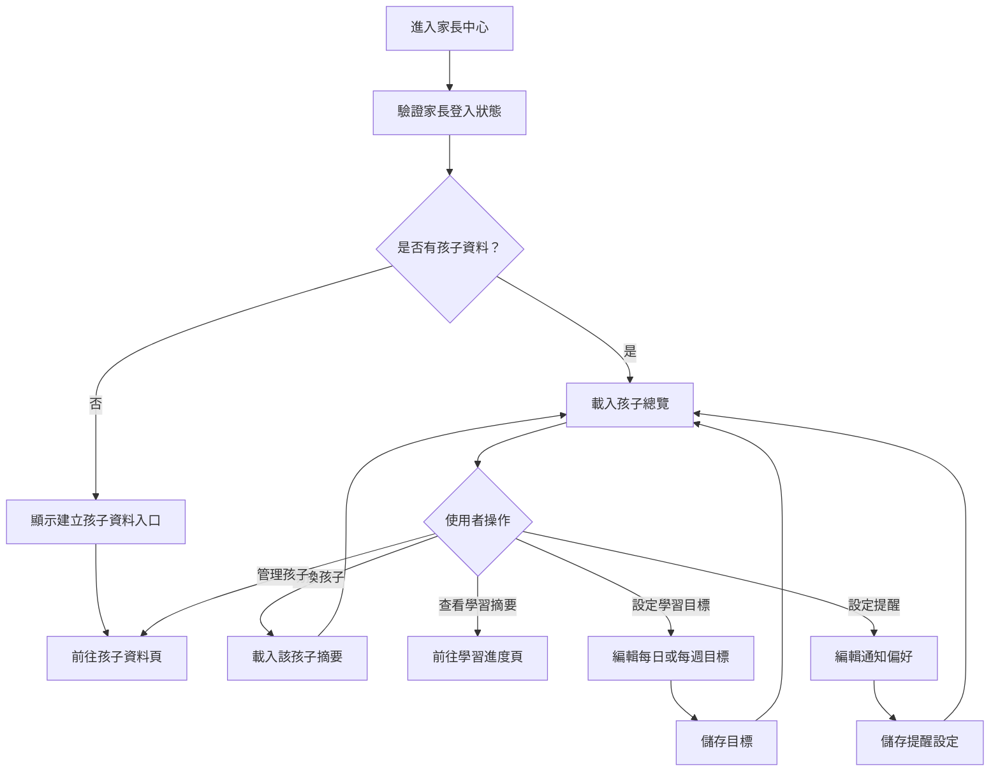

# 家長中心操作流程圖

## 頁面虛線圖

```text
+------------------------------------------------------------+
| 家長中心                         [回首頁] [系統設定]       |
+------------------------------------------------------------+
| 孩子總覽                                      [新增孩子]    |
| +--------------------------------------------------------+ |
| | 小安  今日已學習  本週 4 單元  弱點：聽力              | |
| | [查看進度] [設定目標] [管理資料]                       | |
| +--------------------------------------------------------+ |
|                                                            |
| 學習目標                                                   |
| 每日分鐘 [15__] 每週單元 [5__] 每週練習 [3__]              |
| [儲存目標]                                                 |
|                                                            |
| 提醒設定                                                   |
| [ ] 開啟學習提醒  時間 [19:30 v]                           |
| [ ] 每週報告                                               |
| [儲存提醒]                                                 |
+------------------------------------------------------------+
```

## 按鈕與操作

| 按鈕 | 出現條件 | 點擊後動作 |
| --- | --- | --- |
| 回首頁 | 永遠顯示 | 返回首頁 |
| 系統設定 | 永遠顯示 | 前往系統設定頁 |
| 新增孩子 | 永遠顯示 | 前往孩子資料頁新增模式 |
| 查看進度 | 每位孩子 | 前往該孩子學習進度頁 |
| 設定目標 | 每位孩子 | 載入該孩子目標設定 |
| 管理資料 | 每位孩子 | 前往孩子資料頁 |
| 儲存目標 | 目標表單有變更 | 更新學習目標 |
| 儲存提醒 | 提醒表單有變更 | 更新通知設定 |

## 音效規劃

| 觸發 | 音效 | 規則 |
| --- | --- | --- |
| 儲存目標成功 | `page_success` | 成功後播放 |
| 儲存提醒成功 | `page_success` | 成功後播放 |
| 儲存失敗 | `ui_error_soft` | 搭配錯誤文字 |
| 切換孩子摘要 | `ui_toggle` | 資料載入後播放 |
| 前往管理資料 | `ui_click` | 導向孩子資料頁 |

## 使用者流程



## 正確性檢查

- 家長中心只可讀取自己的孩子。
- 沒有孩子資料時出口需指向孩子資料頁。
- 學習摘要需與學習進度頁資料一致。
- 目標與提醒設定儲存後需能再次讀取。
