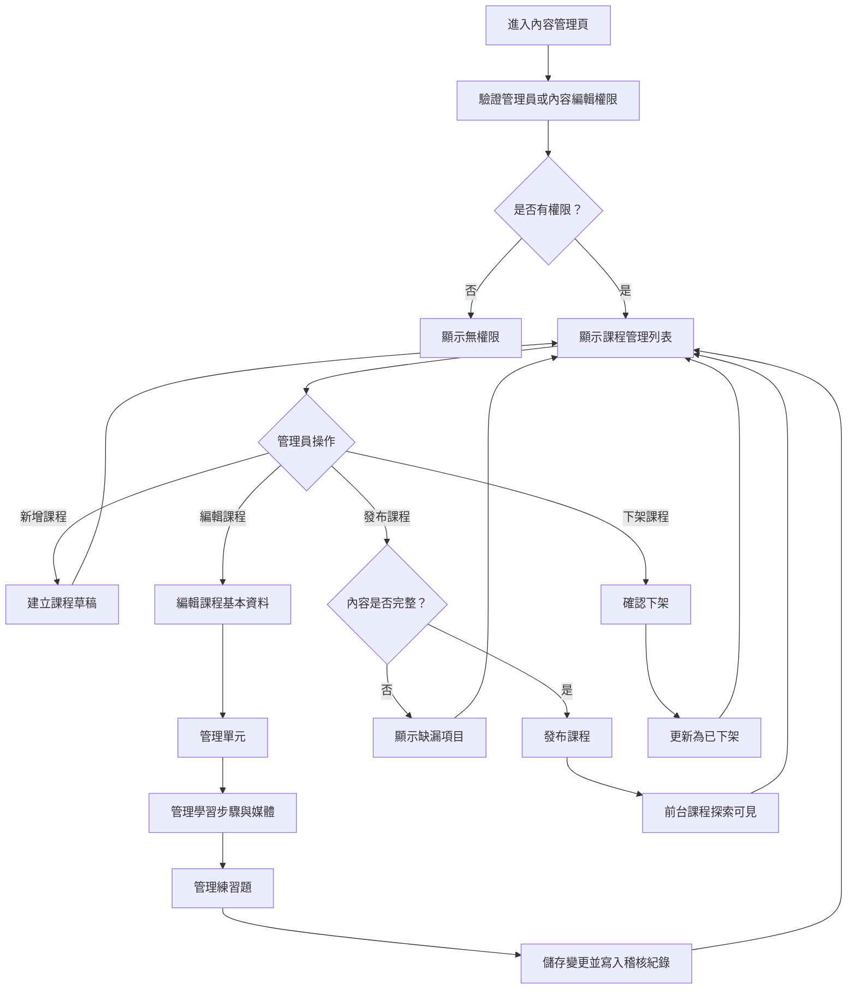

# 內容管理操作流程圖

## 頁面虛線圖

```text
+------------------------------------------------------------+
| 內容管理                         [新增課程] [登出]          |
+------------------------------------------------------------+
| 狀態篩選 [全部 v] 搜尋 [課程名稱________] [搜尋]            |
|                                                            |
| 課程列表                                                   |
| +--------------------------------------------------------+ |
| | 動物英文單字  草稿      [編輯] [預覽] [發布] [刪除]    | |
| | 顏色與形狀    已發布    [編輯] [預覽] [下架]           | |
| +--------------------------------------------------------+ |
|                                                            |
| 編輯課程                                                   |
| 標題 [動物英文單字________] 狀態：草稿                      |
| [基本資料] [單元] [學習內容] [題庫] [媒體]                  |
|                                                            |
| [儲存草稿] [預覽前台] [發布課程] [下架課程]                 |
+------------------------------------------------------------+
```

## 按鈕與操作

| 按鈕 | 出現條件 | 點擊後動作 |
| --- | --- | --- |
| 新增課程 | 有內容編輯權限 | 建立課程草稿 |
| 登出 | 已登入 | 登出並回登入頁 |
| 搜尋 | 有搜尋文字 | 查詢課程列表 |
| 編輯 | 課程列表 | 開啟課程編輯 |
| 預覽 | 課程有基本資料 | 以前台樣式預覽 |
| 發布 | 草稿或下架課程 | 檢查內容完整後發布 |
| 下架 | 已發布課程 | 二次確認後下架 |
| 刪除 | 草稿課程 | 二次確認後刪除或封存 |
| 儲存草稿 | 編輯中 | 儲存目前內容並寫入稽核 |
| 預覽前台 | 編輯中 | 開啟前台預覽 |

## 音效規劃

| 觸發 | 音效 | 規則 |
| --- | --- | --- |
| 儲存草稿成功 | `page_success` | 後台可播放較低音量 |
| 發布成功 | `page_success` | 發布 API 成功後播放 |
| 發布檢查失敗 | `ui_error_soft` | 顯示缺漏項目 |
| 上傳音檔成功 | `page_success` | 可試聽但不自動播放 |
| 預覽音檔 | 教學語音音檔 | 由管理員手動點擊播放 |
| 下架確認 | `ui_error_soft` | 顯示二次確認時播放 |

## 使用者流程



## 正確性檢查

- 非管理員或內容編輯不可進入。
- 課程發布前需檢查必要內容。
- 發布後才可在前台課程探索出現。
- 重要操作都需寫入稽核紀錄。
