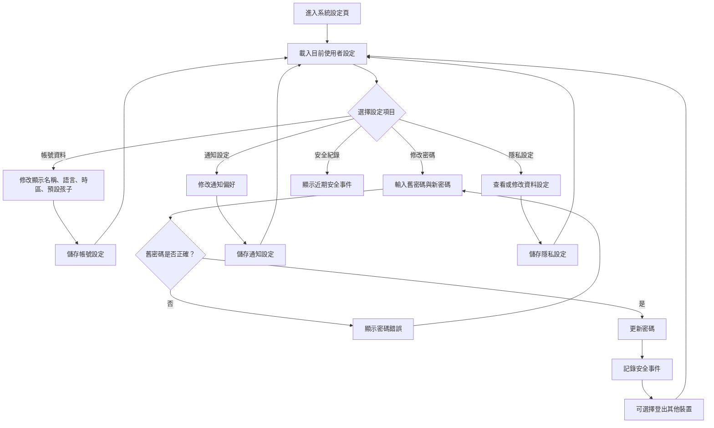

# 系統設定操作流程圖

## 頁面虛線圖

```text
+------------------------------------------------------------+
| 系統設定                                      [回首頁]      |
+------------------------------------------------------------+
| 側邊選單                                                   |
| [帳號資料] [密碼安全] [通知設定] [隱私資料] [安全紀錄]      |
|                                                            |
| 帳號資料                                                   |
| 顯示名稱 [王小明____________]                              |
| 介面語言 [繁體中文 v] 時區 [Asia/Taipei v]                  |
| 預設孩子 [小安 v]                                          |
| [儲存帳號資料]                                             |
|                                                            |
| 密碼安全                                                   |
| 舊密碼 [********] 新密碼 [********] 確認 [********]         |
| [更新密碼] [登出其他裝置]                                  |
+------------------------------------------------------------+
```

## 按鈕與操作

| 按鈕 | 出現條件 | 點擊後動作 |
| --- | --- | --- |
| 回首頁 | 永遠顯示 | 返回首頁 |
| 帳號資料 | 永遠顯示 | 切換到帳號資料區 |
| 密碼安全 | 永遠顯示 | 切換到密碼修改區 |
| 通知設定 | 永遠顯示 | 切換到通知設定區 |
| 隱私資料 | 永遠顯示 | 切換到隱私資料區 |
| 安全紀錄 | 永遠顯示 | 載入近期安全事件 |
| 儲存帳號資料 | 帳號表單有變更 | 更新使用者偏好 |
| 更新密碼 | 密碼欄位完整 | 驗證舊密碼並更新 |
| 登出其他裝置 | 密碼更新成功後 | 讓其他 session 失效 |

## 音效規劃

| 觸發 | 音效 | 規則 |
| --- | --- | --- |
| 儲存帳號資料成功 | `page_success` | 成功後播放 |
| 更新密碼成功 | `page_success` | 搭配安全提示 |
| 密碼錯誤 | `ui_error_soft` | 搭配欄位錯誤文字 |
| 切換設定分頁 | `ui_toggle` | 音效開啟時播放 |
| 關閉音效設定 | 無 | 關閉後不再播放 UI 音效 |
| 調整音量 | `ui_click` | 可播放測試音效，需有「測試音效」按鈕 |

## 使用者流程



## 正確性檢查

- 修改密碼需驗證舊密碼。
- 安全相關操作需寫入安全紀錄。
- 通知、隱私與偏好設定儲存後需能再次讀取。
- 預設孩子需屬於目前登入家長。
