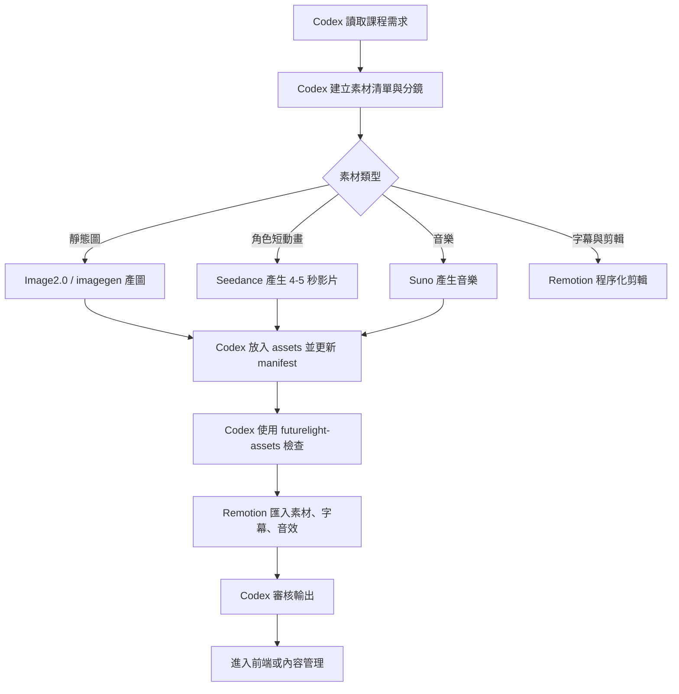

# AI 協作製作流程

本文件定義 FutureLight 在美術、影片、字幕、音樂與審核上的 AI 協作分工。目標是讓每個素材從構想到進專案都有明確負責工具、輸入、輸出與審核規則。

## 製作署名

| 職責 | 工具 / 角色 | 負責內容 |
| --- | --- | --- |
| 總導演 | Codex | 需求拆解、製作規格、素材清單、流程編排 |
| 編排 | Codex | 分鏡、鏡頭節奏、互動導向、字幕時序 |
| 剪輯 | Codex + Remotion | 程式化剪輯、片段排列、動態字幕、輸出驗證 |
| 審核 | Codex | 風格一致性、兒童適齡、可及性、授權與檔案落地 |
| AI 圖像 | Image2.0 / imagegen | 課程封面、單字卡、徽章、角色、故事場景 |
| AI 影片 | Seedance | 角色短動畫、教學角色說話、課程宣傳短片 |
| 程序化剪輯與動態字幕 | Remotion | React 時間軸、字幕、音效同步、學習成果影片 |
| 音樂 | Suno | 主題音樂、短 jingles、獎勵音樂、背景音樂 |

## 工具可用狀態

| 工具 | 本機狀態 | 說明 |
| --- | --- | --- |
| Codex | 可用 | 目前負責規劃、程式、審核、commit/push |
| imagegen | 可用 | 已產生 `animal-english-words-cover.png` |
| GPT Image 2 / Image2.0 on RunComfy | Skill 已存在，改走 Docker | 本機 Windows 無法直接安裝 `@runcomfy/cli`，使用 `tools/runcomfy-docker.ps1` |
| Seedance 2.0 Pro on RunComfy | Skill 已存在，改走 Docker | 需要 RunComfy CLI；目前以 Linux container 執行 |
| Remotion | Skill 已存在 | 可建立 React-based video pipeline |
| HyperFrames | Skill 已存在 | 可建立 HTML/GSAP-based video composition |
| Suno | 未找到本機 skill | 先作為外部音樂產製節點，音檔進 `assets/audio/music` |

## RunComfy 限制

目前執行：

```bash
npm install -g @runcomfy/cli
```

結果：`@runcomfy/cli` 不支援 Windows，需求平台是 `darwin` 或 `linux`。

已採用方案：

1. 使用 Docker Linux container 包裝 RunComfy CLI。
2. 透過 `tools/runcomfy-docker.ps1` 執行健康檢查與生成任務。
3. 生成輸出固定落在 `assets/video/generated`，再登記到 `assets/asset_manifest.json`。

備援方案：

1. 安裝 WSL Ubuntu，於 Ubuntu 內安裝 Node 與 `@runcomfy/cli`。
2. 使用遠端 Linux runner 或 CI 執行 RunComfy 任務。

在 RunComfy 可執行前，專案內仍可先完成：

- prompt 規格
- 素材 manifest
- 檔名規則
- 審核流程
- Remotion / HyperFrames 程序化剪輯
- imagegen 產圖

## 標準製作流程



## 檔案落點

| 類型 | 目錄 |
| --- | --- |
| 課程封面 | `assets/images/course-covers` |
| 單字卡 | `assets/images/word-cards` |
| 徽章 | `assets/images/badges` |
| 角色 | `assets/images/characters` |
| UI 音效 | `assets/audio/ui` |
| 教學語音 | `assets/audio/voice` |
| 音樂 | `assets/audio/music` |
| AI 影片原始輸出 | `assets/video/generated` |
| Remotion 專案 | `video/remotion` |
| HyperFrames 專案 | `video/hyperframes` |

## 審核規則

- 每個素材必須登記在 `assets/asset_manifest.json`。
- AI 圖像不可只留在 Codex 或 RunComfy 暫存資料夾。
- 孩子用素材不可恐怖、羞辱、刺眼或過度刺激。
- 影片字幕不可遮擋主要學習內容。
- 音樂與音效必須可關閉，且不可蓋過教學語音。
- Suno 或任何外部音樂需記錄授權、產製日期與用途。

## FutureLight 建議用法

第一階段：

- Codex + imagegen：補齊課程封面、單字卡、徽章。
- Remotion：建立第一支「動物英文單字」課程介紹短片。
- futurelight-assets：每次新增素材後檢查 manifest。

第二階段：

- 使用 `docs/RunComfy執行方案.md` 的 Docker runner 啟用 Image2.0 與 Seedance。
- Seedance 產角色短動畫。
- Suno 產課程主題音樂與獎勵 jingle。
- Remotion 統一剪輯、字幕與輸出。

第三階段：

- 內容管理後台支援上傳 AI 圖像、影片、音樂。
- 發布課程前自動跑 `futurelight-assets` 與 `futurelight-content-checker`。
