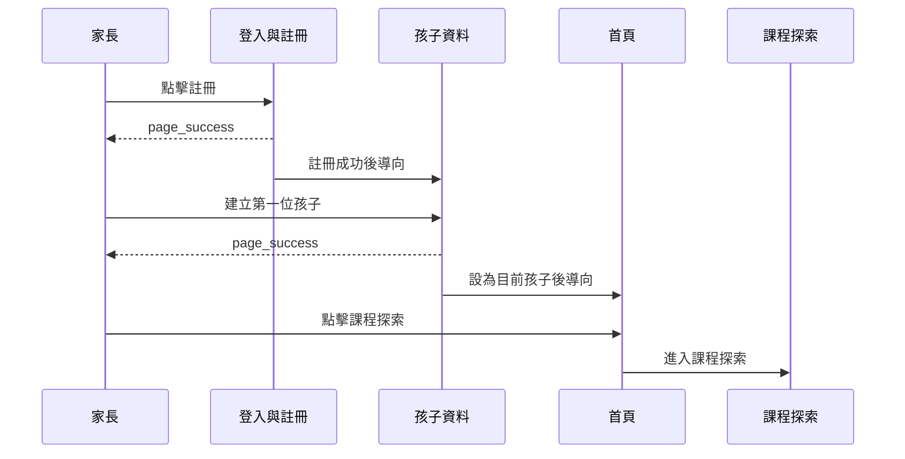
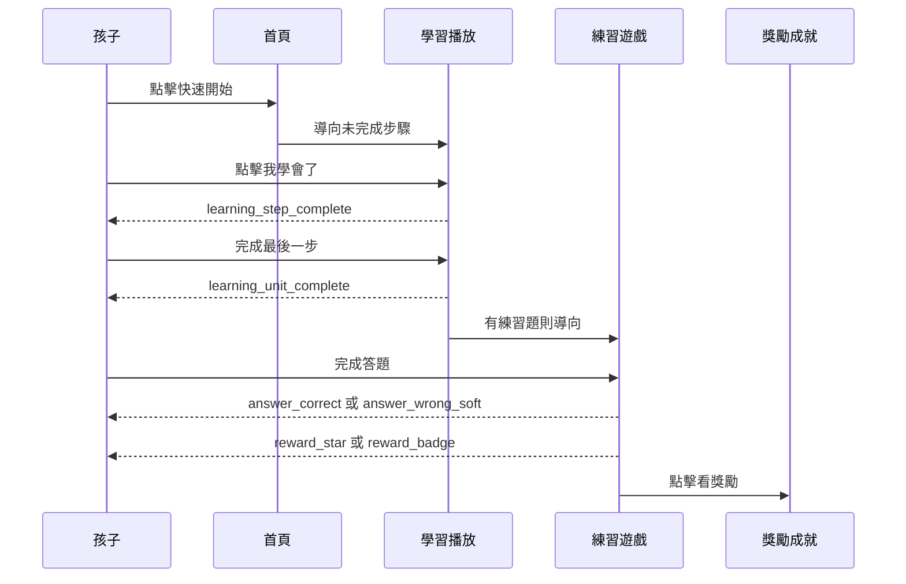
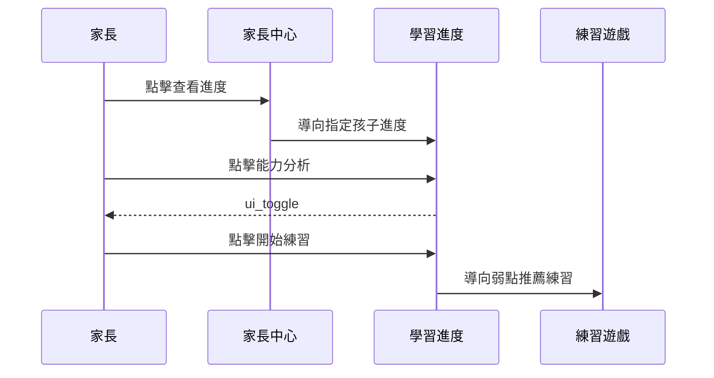
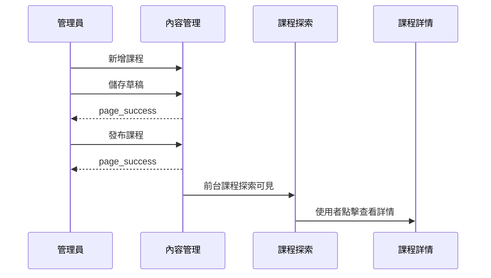

# 全站互動導向規劃

本文件集中整理每個頁面按鈕會導向哪個頁面、哪些操作屬於連續流程、換頁動畫如何表現，以及點選音效如何播放。

## 頁面代號

| 代號 | 頁面 |
| --- | --- |
| `home` | 首頁 |
| `auth` | 登入與註冊 |
| `child-profile` | 孩子資料 |
| `course-explore` | 課程探索 |
| `course-detail` | 課程詳情 |
| `learning-player` | 學習播放 |
| `practice-game` | 練習遊戲 |
| `progress` | 學習進度 |
| `rewards` | 獎勵成就 |
| `parent-center` | 家長中心 |
| `content-admin` | 內容管理 |
| `settings` | 系統設定 |

## 全站按鈕導向矩陣

| 來源頁面 | 按鈕或操作 | 目標頁面 | 導向條件 | 點選音效 |
| --- | --- | --- | --- | --- |
| 首頁 | 登入 | 登入與註冊 | 未登入 | `ui_click` |
| 首頁 | 註冊 | 登入與註冊 | 未登入，開啟註冊模式 | `ui_click` |
| 首頁 | 建立孩子資料 | 孩子資料 | 已登入但沒有孩子 | `ui_click` |
| 首頁 | 快速開始 | 學習播放 | 有未完成學習步驟 | `ui_click` |
| 首頁 | 快速開始 | 練習遊戲 | 學習完成但有待練習 | `ui_click` |
| 首頁 | 快速開始 | 課程詳情 | 沒有進度，使用推薦課程 | `ui_click` |
| 首頁 | 查看課程 | 課程詳情 | 有推薦課程 | `ui_click` |
| 首頁 | 課程探索 | 課程探索 | 永遠可用 | `ui_click` |
| 首頁 | 練習遊戲 | 練習遊戲 | 有可練習內容 | `ui_click` |
| 首頁 | 學習進度 | 學習進度 | 已登入且有孩子 | `ui_click` |
| 首頁 | 獎勵成就 | 獎勵成就 | 已登入且有孩子 | `ui_click` |
| 首頁 | 家長中心 | 家長中心 | 已登入 | `ui_click` |
| 登入與註冊 | 回首頁 | 首頁 | 永遠可用 | `ui_click` |
| 登入與註冊 | 登入成功 | 首頁 | 家長角色 | `page_success` |
| 登入與註冊 | 登入成功 | 內容管理 | 管理員角色 | `page_success` |
| 登入與註冊 | 建立帳號成功 | 孩子資料 | 新家長註冊完成 | `page_success` |
| 孩子資料 | 回首頁 | 首頁 | 已有目前孩子 | `ui_click` |
| 孩子資料 | 儲存第一位孩子 | 首頁 | 建立成功並設為目前孩子 | `page_success` |
| 孩子資料 | 取消 | 孩子資料 | 回列表，不換頁 | `ui_click` |
| 課程探索 | 回首頁 | 首頁 | 永遠可用 | `ui_click` |
| 課程探索 | 查看詳情 | 課程詳情 | 點擊課程卡片 | `ui_click` |
| 課程探索 | 查看熱門課程 | 課程探索 | 清除條件，不換頁 | `ui_toggle` |
| 課程詳情 | 返回探索 | 課程探索 | 永遠可用 | `ui_click` |
| 課程詳情 | 開始學習 | 學習播放 | 課程尚未開始 | `ui_click` |
| 課程詳情 | 繼續學習 | 學習播放 | 下一步是學習步驟 | `ui_click` |
| 課程詳情 | 繼續學習 | 練習遊戲 | 下一步是練習 | `ui_click` |
| 課程詳情 | 練習 | 練習遊戲 | 單元有練習題 | `ui_click` |
| 學習播放 | 返回課程 | 課程詳情 | 永遠可用 | `ui_click` |
| 學習播放 | 離開並儲存 | 課程詳情 | 儲存目前進度後 | `ui_click` |
| 學習播放 | 下一個 | 學習播放 | 還有下一步，不換頁 | `learning_step_complete` |
| 學習播放 | 完成最後一步 | 練習遊戲 | 單元有練習題 | `learning_unit_complete` |
| 學習播放 | 完成最後一步 | 獎勵成就 | 單元完成且有新獎勵 | `learning_unit_complete` |
| 學習播放 | 完成最後一步 | 課程詳情 | 無練習題且無新獎勵 | `learning_unit_complete` |
| 練習遊戲 | 返回課程 | 課程詳情 | 永遠可用 | `ui_click` |
| 練習遊戲 | 下一題 | 練習遊戲 | 還有下一題，不換頁 | `ui_click` |
| 練習遊戲 | 再練一次 | 練習遊戲 | 結果頁重新建立 session | `ui_click` |
| 練習遊戲 | 看獎勵 | 獎勵成就 | 結果頁有新獎勵 | `reward_star` 或 `reward_badge` |
| 練習遊戲 | 回課程 | 課程詳情 | 結果頁 | `ui_click` |
| 學習進度 | 回首頁 | 首頁 | 永遠可用 | `ui_click` |
| 學習進度 | 查看課程 | 課程詳情 | 點擊課程進度 | `ui_click` |
| 學習進度 | 繼續學習 | 學習播放 | 課程有未完成學習 | `ui_click` |
| 學習進度 | 重新練習 | 練習遊戲 | 有練習題 | `ui_click` |
| 學習進度 | 開始練習 | 練習遊戲 | 有弱點建議 | `ui_click` |
| 獎勵成就 | 回首頁 | 首頁 | 永遠可用 | `ui_click` |
| 獎勵成就 | 去學習 | 課程探索 | 沒有明確待學內容 | `ui_click` |
| 獎勵成就 | 開始任務 | 學習播放 | 任務對應學習單元 | `ui_click` |
| 獎勵成就 | 開始任務 | 練習遊戲 | 任務對應練習 | `ui_click` |
| 家長中心 | 回首頁 | 首頁 | 永遠可用 | `ui_click` |
| 家長中心 | 系統設定 | 系統設定 | 永遠可用 | `ui_click` |
| 家長中心 | 新增孩子 | 孩子資料 | 新增模式 | `ui_click` |
| 家長中心 | 查看進度 | 學習進度 | 指定孩子 | `ui_click` |
| 家長中心 | 管理資料 | 孩子資料 | 指定孩子 | `ui_click` |
| 內容管理 | 登出 | 登入與註冊 | 登出成功 | `ui_click` |
| 內容管理 | 預覽前台 | 課程詳情 | 管理員預覽模式 | `ui_click` |
| 系統設定 | 回首頁 | 首頁 | 永遠可用 | `ui_click` |

## 連續流程

### 流程 1：新家長第一次使用

### 流程 2：孩子完成一個學習單元

### 流程 3：家長查看弱點並安排練習

### 流程 4：管理員建立內容並前台可見

## 換頁動畫規劃

| 換頁類型 | 適用情境 | 動畫 | 時間 | 音效規則 |
| --- | --- | --- | --- | --- |
| 一般導向 | 首頁到課程探索、課程詳情、進度等 | 淡入淡出 + 內容上移 8px | 180ms | 使用按鈕點擊音效，不額外播放換頁音 |
| 前進學習流程 | 課程詳情到學習播放、學習播放到練習遊戲 | 右進左出 | 220ms | 保留原按鈕音效，下一頁語音延遲到動畫後 |
| 返回上一層 | 學習播放返回課程、課程詳情返回探索 | 左進右出 | 180ms | `ui_click` |
| Modal 或確認框 | 停用孩子、下架課程、錯誤提示 | 背景淡入 + 面板縮放 98% 到 100% | 140ms | 錯誤或確認類可用 `ui_error_soft` |
| Tab 切換 | 進度 Tab、獎勵 Tab、設定側邊選單 | 內容淡入，不移動畫面 | 120ms | `ui_toggle`，需節流 |
| 完成或獎勵 | 單元完成、練習結果、徽章解鎖 | 星星彈跳或徽章浮現 | 300ms | `reward_star`、`reward_badge` |

## 動畫實作規則

- 所有換頁動畫不可阻擋資料載入錯誤顯示。
- 學習播放頁的教學語音必須等換頁動畫結束後才可自動播放。
- 使用者設定降低動態效果時，動畫縮短為 0ms 到 80ms，保留必要狀態切換。
- 手機上避免大幅滑動，優先使用淡入與小位移。
- 獎勵動畫只在新獎勵產生時播放，不在每次進入獎勵頁時重播。

## 點選音效規則

| 操作類型 | 音效 | 播放時機 |
| --- | --- | --- |
| 主要按鈕 | `ui_click` | pointer up 後、開始導向前 |
| Tab 或切換器 | `ui_toggle` | 狀態切換成功後 |
| 儲存成功 | `page_success` | API 成功回傳後 |
| 表單錯誤 | `ui_error_soft` | 驗證失敗後 |
| 學習步驟完成 | `learning_step_complete` | 後端記錄成功後 |
| 單元完成 | `learning_unit_complete` | 單元完成狀態寫入成功後 |
| 答對 | `answer_correct` | 答案判定成功後 |
| 答錯 | `answer_wrong_soft` | 答案判定失敗後 |
| 星星增加 | `reward_star` | 星星數字動畫開始時 |
| 新徽章 | `reward_badge` | 徽章解鎖動畫開始時 |

## 點選音效限制

- 音效關閉時，所有 UI 音效都不播放。
- 同一按鈕 300ms 內不可重複播放點擊音。
- 教學語音播放中，`ui_click` 與 `ui_toggle` 音量降到設定值的 50%。
- 答對、答錯音效不可被快速下一題中斷，下一題按鈕需等回饋至少播放 300ms。
- 路由跳轉失敗時，播放 `ui_error_soft` 並留在原頁。
