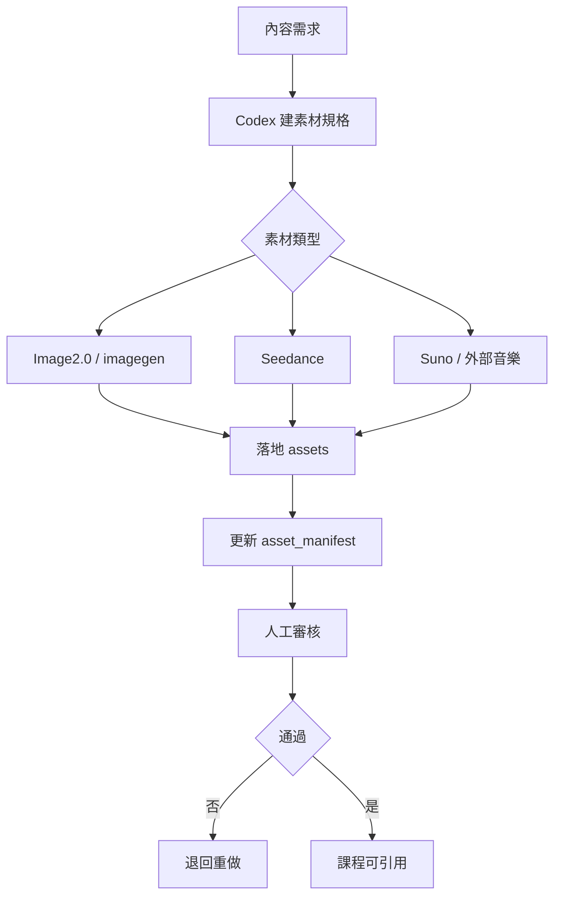

# 技術落地藍圖

Created: 2026-06-01 08:32:25 +08:00

FutureLight 的技術實作要支撐可上線產品，不只是頁面 demo。本文件定義 React、Rust、PostgreSQL、AI 素材、測試、部署與 port migration 的落地路線。

## 1. Port migration 第一優先

不得啟動舊 ports。先完成：

| 檔案 | 舊值 | 新值 |
| --- | --- | --- |
| `.env.example` | `5433`, `4000` | `37432`, `37200` |
| `backend/src/main.rs` | default `4000`, DB `5433` | default `37200`, DB `37432` |
| `frontend/vite.config.ts` | `5173`, proxy `4000` | `37173`, proxy `37200` |
| `docker-compose.yml` | `5433:5432` | `37432:5432` |
| `README.md` | old dev ports | only migrated ports |

啟動前檢查：

```powershell
Get-NetTCPConnection -LocalPort 37173,37200,37432 -ErrorAction SilentlyContinue
```

## 2. Frontend 架構

### 2.1 路由

必備 routes：

- `/`
- `/login`
- `/children`
- `/courses`
- `/courses/:courseId`
- `/learn/:sessionId`
- `/practice/:sessionId`
- `/progress/:childId`
- `/rewards/:childId`
- `/parent`
- `/parent/settings`
- `/parent/privacy`
- `/admin/content`
- `/admin/assets`

### 2.2 狀態

需要分離：

- auth state
- selected child
- learning session
- audio settings
- reduced motion
- offline package status
- parent gate state

### 2.3 UI 元件

必備元件：

- `AppShell`
- `ChildSwitcher`
- `CourseCard`
- `LessonStepPlayer`
- `AudioButton`
- `PronunciationPrompt`
- `AnswerOption`
- `RewardToast`
- `ProgressRing`
- `ParentGateModal`
- `SettingsToggle`
- `AssetPicker`

### 2.4 可及性

- 所有互動元件有 accessible name。
- 主流程可鍵盤操作。
- 音效可關閉。
- 動畫遵守 `prefers-reduced-motion`。
- 字幕與文字不能遮擋圖卡。
- 觸控目標至少 44px。

## 3. Backend 架構

Rust API 應拆分：

```text
backend/src/
  main.rs
  config.rs
  error.rs
  routes/
  services/
  repositories/
  models/
  db/
  auth/
  privacy/
```

### 3.1 Domain services

- `CourseService`
- `LearningSessionService`
- `AttemptService`
- `SpacedRepetitionService`
- `RewardService`
- `ConsentService`
- `DataDeletionService`
- `AssetReviewService`
- `EntitlementService`

### 3.2 API behavior

- 所有 request 做 validation。
- 所有 response 有一致 error shape。
- 兒童資料 API 必須檢查 parent-child ownership。
- admin API 必須有角色權限。
- data deletion 必須 async job + audit log。

## 4. PostgreSQL Schema

### 4.1 Core

- `users`
- `sessions`
- `parent_profiles`
- `children`
- `parent_child_links`
- `child_settings`

### 4.2 Content

- `courses`
- `course_units`
- `lesson_steps`
- `activities`
- `activity_options`
- `content_versions`
- `course_publish_checks`

### 4.3 Learning

- `learning_sessions`
- `attempts`
- `word_mastery`
- `review_queue`
- `learning_events`

### 4.4 Rewards

- `reward_definitions`
- `child_rewards`
- `star_ledger`

### 4.5 Assets

- `assets`
- `asset_variants`
- `asset_reviews`
- `ai_generation_jobs`
- `asset_license_records`

### 4.6 Privacy / audit

- `consents`
- `privacy_notices`
- `data_export_requests`
- `deletion_requests`
- `audit_logs`

## 5. AI 素材管線

每個 AI 素材都必須有：

- source prompt
- model
- generation date
- operator
- intended course / page
- safety review
- license status
- final file path
- manifest entry

流程：



## 6. 測試策略

### 6.1 Unit

- SRS scheduling
- mastery score calculation
- parent gate validation
- entitlement rules
- content publish checks
- data deletion selectors

### 6.2 Integration

- course list / detail
- start learning session
- submit attempt
- update progress
- parent data export
- delete child data
- asset publish blocker

### 6.3 E2E

- 新家長建立孩子並開始課程。
- 孩子完成一節動物英文。
- 孩子答錯後看到安全回饋。
- 家長查看進度。
- 家長關閉音效後兒童區不播放 UI 音效。
- 家長刪除孩子資料後兒童端不可再取得資料。

## 7. CI/CD

必跑：

- frontend typecheck
- frontend build
- Rust fmt
- Rust clippy
- Rust tests
- migration check
- assets checker
- content checker
- Playwright smoke test
- secret scan

## 8. 部署分層

| 環境 | 用途 | 資料 | 需求 |
| --- | --- | --- | --- |
| local | 開發 | migration + 明確標記的測試 seed | 遵守 port registry；不把 mock 當完成 |
| staging | 商店審核 / beta | 可重建測試資料 | Cloudflare protected；資料流需接真實 API/DB |
| production | 真實使用者 | 真實資料 | managed DB、backup、monitoring |

## 9. Observability

需要監控：

- API latency
- API error rate
- DB connection pool
- course publish failures
- asset missing
- learning session completion
- crash-free sessions
- data deletion job status

兒童區 analytics 必須資料最小化，不記錄可識別個資。

## 10. 下一步實作順序

1. Port migration。
2. DB migration system。
3. Course / content schema。
4. React routes。
5. Real API data flow。
6. Learning session + attempt tracking。
7. Parent gate + consent。
8. Asset review workflow。
9. E2E tests。
10. Store readiness docs。
